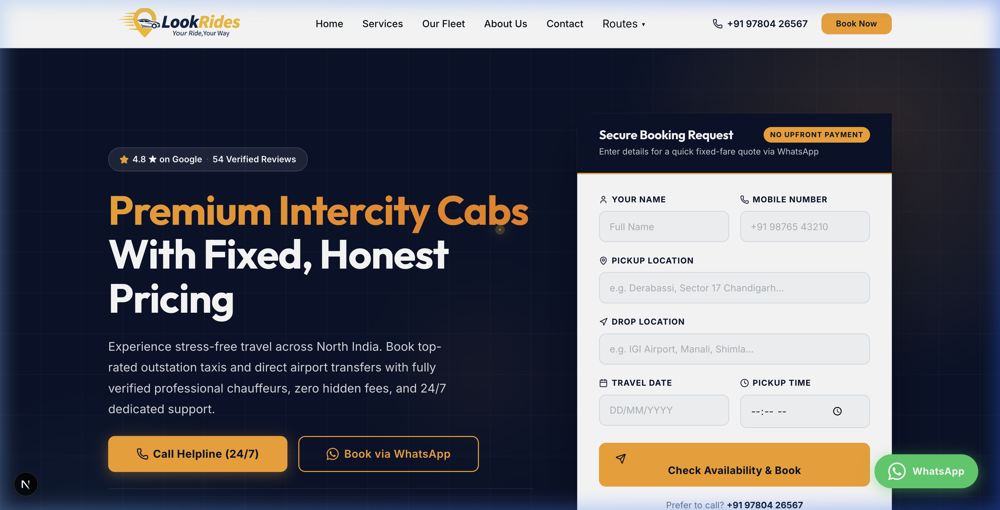
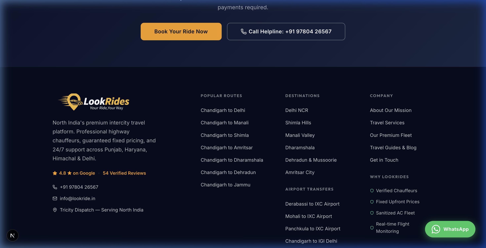
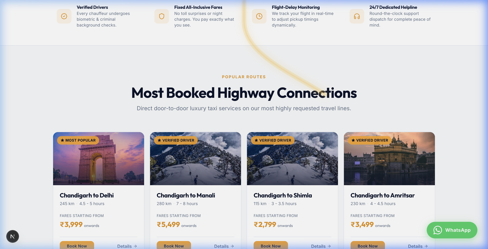
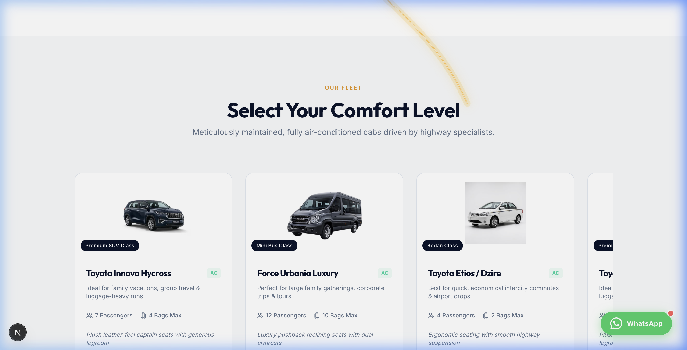

# LookRides 🚖 | Premium Intercity Taxi Platform

> **LookRides** is a highly optimized, full-stack Next.js web application built for a premium intercity taxi and airport transfer service operating across North India (Chandigarh, Mohali, Zirakpur, Delhi, Himachal Pradesh). 

This repository showcases an enterprise-grade booking platform featuring real-time Telegram notifications, a secure Supabase backend for rate-limiting and contact persistence, and a heavily optimized, programmatic SEO architecture designed to dominate local and regional search results.

---

## 🚀 Key Features

### 1. High-Performance Front-End
- **Framework:** Built on **Next.js (App Router)** for lightning-fast server-side rendering (SSR) and static site generation (SSG).
- **Core Web Vitals:** Achieves near-perfect Lighthouse scores. All heavy image assets (like destination banners) are bulk-compressed to WebP format, and the LCP (Largest Contentful Paint) is heavily optimized.
- **Responsive Design:** 100% mobile-responsive layout built with modern CSS Modules, featuring beautiful glassmorphism effects, dynamic carousels, and smooth micro-animations.

### 2. Programmatic SEO Architecture
- **Dynamic Semantic Routes:** Automatically generates localized textual content for dozens of dynamic routes (e.g., `routes/[slug]`) to prevent Google "Thin Content" penalties.
- **Rich JSON-LD Schemas:** Implements deep `WebSite`, `LocalBusiness`, `Service`, and `Article` Schemas, injecting them directly into the layouts and dynamic pages.
- **Markdown Blog Engine:** Custom-built static blog architecture using `gray-matter` and `remark` to capture long-tail, high-intent informational search queries.
- **Internal Linking Engine:** Safely clusters and links related routes, guaranteeing clean Googlebot crawl paths.

### 3. Secure Backend & Integrations
- **Supabase PostgreSQL:** Powers the secure backend architecture for storing contact form submissions and rate-limiting data.
- **Telegram Bot API:** Instant, real-time push notifications sent directly to the dispatch team whenever a new booking is requested.
- **Edge Security:** Implements strict CORS headers, robust API validation, and table-based rate limiting designed to survive Vercel cold starts.

---

## 📸 Interface Showcase

### The Booking Experience
The primary call-to-action is a frictionless booking widget designed to convert. It seamlessly passes parameters and triggers a real-time Telegram notification upon submission.

### Dynamic Route & Destination Showcases
Programmatic rendering of popular travel routes out of the Tricity area (Chandigarh to Shimla, Manali, Delhi).

### Premium Fleet Display
Interactive Embla-powered carousel showcasing the luxury fleet (Innova Crysta, Etios, Urbania).

---

## 🛠️ Tech Stack

- **Core:** React, Next.js (App Router), TypeScript
- **Styling:** CSS Modules, Custom Design Tokens
- **Database / Auth:** Supabase (PostgreSQL), Row Level Security (RLS)
- **Content:** `gray-matter`, `remark` (Markdown processing)
- **Deployment & Edge:** Vercel

---

## 🔒 License & Copyright

**All Rights Reserved.**

This repository contains proprietary source code created as a freelance project for **LookRides**. It is made public strictly for **portfolio showcase purposes**. 

You are **NOT** permitted to use, copy, modify, merge, publish, distribute, sublicense, or sell copies of this software, its design assets, or its proprietary components under any circumstances. 

---
*Developed with ❤️ by Pahul.*
