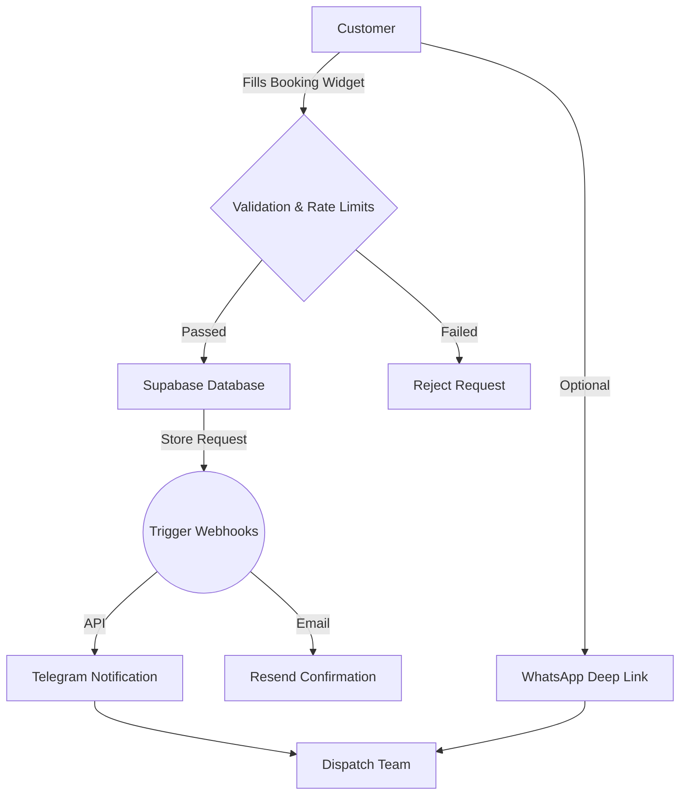

# LookRides 🚖 | Premium Intercity Taxi Platform

LookRides is a highly optimized, full-stack Next.js web application built for a premium intercity taxi and airport transfer service operating across North India (Chandigarh, Mohali, Zirakpur, Delhi, Himachal Pradesh). 

It showcases an enterprise-grade booking platform featuring real-time Telegram notifications, a secure Supabase backend, and a heavily optimized programmatic SEO architecture designed to dominate regional search results.

---

## 🖼️ Product Showcase

| 1. Frictionless Booking Widget | 2. Dynamic SEO Route Pages |
| :---: | :---: |
| *(Screenshot Placeholder)* | *(Screenshot Placeholder)* |
| **3. Premium Fleet Carousel** | **4. Live Google Reviews Sync** |
| *(Screenshot Placeholder)* | *(Screenshot Placeholder)* |
| **5. Full Administrative Dashboard** | **6. Pricing & Fleet Management** |
| *(Screenshot Placeholder)* | *(Screenshot Placeholder)* |

---

## 🌟 Vision & Impact

LookRides replaces traditional call-and-haggle taxi bookings with a sleek, transparent, and instant digital experience. Built for scale, it handles thousands of visitors while seamlessly passing confirmed leads directly to the dispatch team's devices in real-time.

### Core Value Proposition
- **Frictionless Conversions:** Zero-upfront payment philosophy paired with a hyper-optimized booking widget.
- **Programmatic SEO Dominance:** Dynamic, JSON-LD injected routes designed to capture long-tail regional search traffic without manual content creation.
- **Instant Dispatch Operations:** Direct integration with WhatsApp and Telegram APIs to instantly notify drivers of new bookings.
- **Edge Security & Performance:** Next.js App Router providing lightning-fast server-side rendering with strict Content Security Policies.

### Booking Lifecycle Architecture

---

## 🛠️ Architecture Highlights

- **Frontend**: Next.js 14 (App Router), React 18, CSS Modules, Lucide Icons.
- **Backend**: Supabase (PostgreSQL), Edge API Routes, JWT Admin Authentication.
- **Security**: PostgreSQL Row Level Security (RLS) with `is_admin` claims, strict CSP headers, fail-closed rate limiters.
- **Integrations**: Telegram Bot API, Resend Email API, WhatsApp Click-to-Chat, SerpAPI (Google Reviews Sync).

---

## 📂 System Topography

### Public Platform
- **Booking Engine** — Widget with dynamic route, date, and vehicle selection.
- **Dynamic Route Pages** — SEO-optimized landing pages for 15+ intercity routes (e.g., `routes/[slug]`) complete with pricing tables and LocalBusiness schema.
- **Content Marketing** — Static markdown blog engine (`gray-matter` + `remark`) for capturing informational travel queries.

### Administrative Portal (`/admin`)
- **JWT Dashboard** — Secure overview of total bookings, contacts, reviews, and fleet status.
- **Operations** — Full CRUD management for incoming bookings (with CSV export) and customer messages.
- **Asset Management** — Live editing of fleet vehicles, dynamic route pricing, and site settings.
- **Testimonial Sync** — Approve/hide manual testimonials or trigger automated Google Reviews synchronization.

---

## 📄 License & Copyright

**All Rights Reserved.**

This repository contains proprietary source code created as a freelance project for **LookRides**. It is made public strictly for **portfolio showcase purposes**. 

You are **NOT** permitted to use, copy, modify, merge, publish, distribute, sublicense, or sell copies of this software, its design assets, or its proprietary components under any circumstances. 

---
*Developed with ❤️ by Pahul.*
